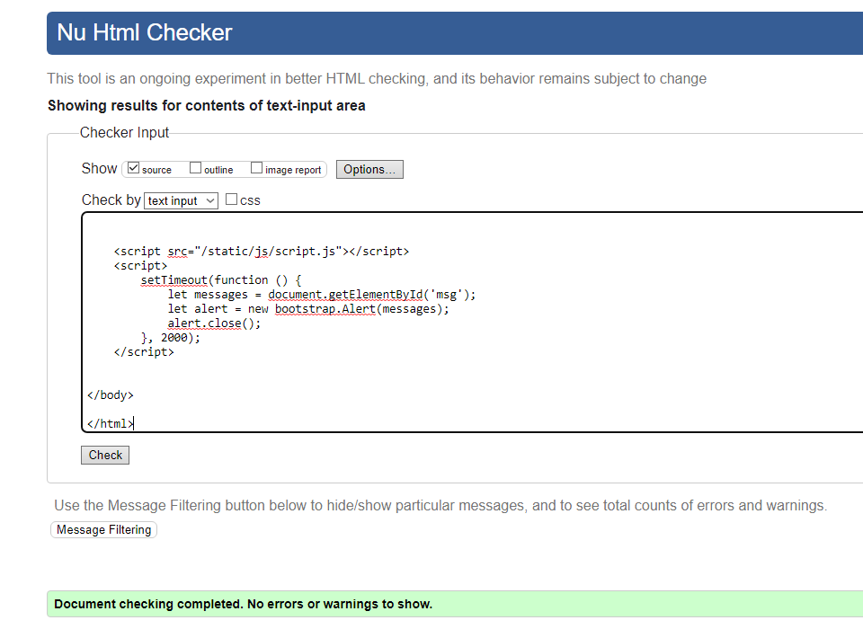
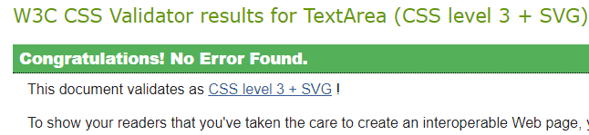
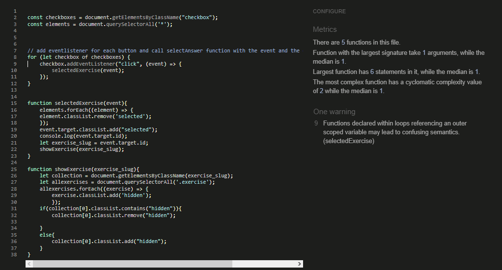
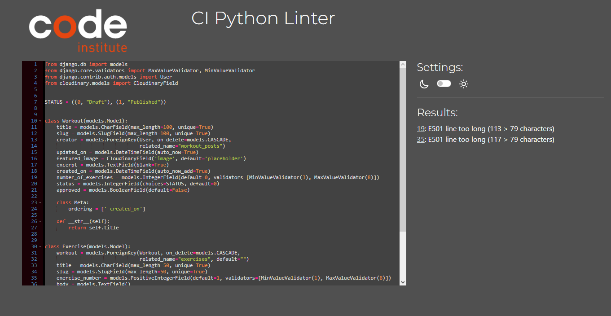

# **Workout-Buddy**

## A Workout helper website.
> A Workout-tracker/helper website showcasing workouts created by either any User or Admin. The site allows users to create a profile and in turn create, read, edit and delete workouts they have created. 

### - By Oscar Eriksson

## **[Live site](https://workout-buddie-94d99620166c.herokuapp.com)**

---

## **[Repository](https://github.com/Oile995/Project4)**

---
  
## Table of contents
<a name="contents">Back to Top</a>
 1. [ UX ](#ux)
 2. [Agile Development](#agile)
 3. [ Features ](#features)  
 4. [ Features Left to Implement ](#left)  
 5. [ Technology used ](#tech) 
 6. [ Testing ](#testing)  
 7. [ Bugs ](#bugs)  
 8. [ Credits](#credits)
 9. [ Content](#content)  
 10. [ Acknowledgements](#acknowledgements)  
 

## UX

#### Pre-project Planning

> Database Structure

- When I decided on my initial concept of La concina del diablo I knew I needed to understand what type of data I would need to store and the relationships between them.
- I created the above diagram on lucidchart to help guide me.
- As of now when the project is finished the only model not implemented is the tickets model. 
- As explained below I have decided to ommit this feature until a further release / iteration.

### Database Schema
#### AllAuth User

| id | Field |
|--|--|
| User |OneToOneField  |
| Username |Charfield|
|email|EmailField|
|Password|Charfield|

---

#### Workout Model

| id | Field |
|--|--|
|Title|Charfield|
|Slug|Slugfield|
|Creator|Foreignkey|
|Updated on|Datefield|
|Featured Image|Cloudinary image|
|Excerpt|TextField|
|Created on|Datefield|
|Number_of_Exercises|Integerfield|
|Status|IntegerField|
|Approved|Boolean|

---

#### Exercise Model

| id | Field |
|--|--|
|Title|Charfield|
|Workout|Foreignkey|
|Slug|Slugfield|
|Body|TextField|
|Exercise Image|Cloudinary image|
|Muscle Image|Cloudinary image|
|Approved|Boolean|
|Exercises number|Integerfield|

---

# UX design

## Overview

Workout Buddy is a fictional brand name for a website that helps users in different ways when it comes to workouts and exercises. The main goal is for the users to view all the pre-existing workouts, create, edit or delete their own created workouts and get some insight and knowledge on how to do those exercises that’s detailed with description and pictures of the workouts.

### Design
The main goal for the design was: simple and easy to maneuver with bright colors, clear and easy to follow instructions, so it’s suitable even for the older generation.
In the future implement User and tracking features which will allow for statistics an records.

### Site User

- Someone willing to be a part of a community where they can browse all kinds of different workouts and exercises.
- A place for someone to create their own personal workout with the options of editing (adding new workouts etc.) or deleting their workout with an easy to follow setup.
- A place for someone that doesn’t have much experience with working out and where they can pick one of the workouts and start with something they find simple and easy to follow.

###  Goals for the website

- Allow users to create, use, edit and delete workouts.
- That the process of creating a workout is easy and has simple instructions.
- Allow users to track their progress with the given workout by using the + button
- User based Features Implemented:
- Users can create an account 
- Users can log into their account
- Users can log out of their account
- Users can create their own workout
- Users can edit their own workout
- Users can delete their own workout
- Users can use the already pre-existing workouts
- Users can track their workout progress with the (check) button
- Users can access to My Page where they can see their own created workouts

## Wireframes

###  Wireframes

> Wireframe for project with future featured Profile page in the bottom left.

My goal for this project was to create a simple but friendly looking website that allowed users to create edit and delete workouts.

## Agile Development

### Agile Overview

This project was started alongside a GitHub Projects Page to track and manage the expected workload ahead.
The initial aim was to track steps and features needed to get the functionallity and layout as per project goal. 
Ultimatly I ended up bury myself in epics at a time as my inital user stories were not specific or framed in an accurate way to fit the project outcome.

To see Kanban please click [here](https://github.com/users/Oile995/projects/1/).

At the initial stages I decided on 6 core requirements for the project and 2 Nice to haves but not important. (**NINTH**).

From these I added the user stories, acceptance criteria and the tasks so I can track my work effectively. 
I did however have to update some of the userstories as their task and accptance critera was flawed from the begining. (As this was my first agile project)

My plan was that, once I completed a task I would tick the appropriate box and if all parts of this story were completed I would move it from **in progress** to **completed**.
However, due to getting stuck early in the project with both the Agile preparation and getting the Project baseline part and models created, I did not update the Agile tool as offen as I initially intended.

I did for some of the milestones but primarly for future project I want to update the agile tool with the following:

 - What was done
 - What is left to be done
 - Reminders for myself to track where I finished so when I returned the following day I knew where I left off.

#### User stories

#####  Completed User Stories

To view any of the expanded details of the user stories please click on a user story below to be taken to the Kanban project.
If the specific user story does not auto pop up then please click on it from the project page and you will see the details and comments.

 1. [USER STORY: Deploy Website#6](https://github.com/Oile995/Project4/issues/6)
 2. [USER STORY: Admin Panel#12](https://github.com/Oile995/Project4/issues/12)
 3. [USER STORY: Create an Workout (CRUD)#3](https://github.com/Oile995/Project4/issues/3)
 4. [USER STORY: Index Workout list pagination#1](https://github.com/Oile995/Project4/issues/1)
 5. [USER STORY: Make a account#4](https://github.com/Oile995/Project4/issues/4)
 6. [USER STORY: View Workouts#13](https://github.com/Oile995/Project4/issues/13)
 7. [USER STORY: Edit Workout (CRUD)#11](https://github.com/Oile995/Project4/issues/11)
 8. [USER STORY: Delete Workout (CRUD)#14](https://github.com/Oile995/Project4/issues/14)
 9. [USER STORY: Add media to Workout and exercises#10](https://github.com/Oile995/Project4/issues/10)

The following User stories were not completed as they were deemed to be not necessary for this project at this time but are indications of possible future features:
 ##### Should User stories
 1. [USER STORY: Use Workout#2](https://github.com/Oile995/Project4/issues/2)

 ##### NINTH User stories
 
 1. [USER STORY: Add Likes and Comments#8](https://github.com/Oile995/Project4/issues/8)
 2. [USER STORY: View Likes and Comments #9](https://github.com/Oile995/Project4/issues/9)
 3. [USER STORY: Track Workout#5](https://github.com/Oile995/Project4/issues/5)

While USER STORY: Events#2 has some parts completed in terms of displaying exercises completed with checkbox, I decided against implementing a more indepth tracking system at this time due to upcoming submission deadlines and because the core requirements of the project have been satisfied elsewhere.

[Back to Top of page](#contents)

---

## Features

#### User based Features Implemented:

 - **Users can** create an account (**Create**)
 - **Users can** log into their account
 - **Users can** log out of their account
 - **Users can** create their own workout **(Create)**
 - **Users can** access their profile page & view their workouts, regardless if they  are published or approved by admin **(Read)**
 - **Users can** view workouts from home page (**Read**)
 - **Users can** edit their own workout (**Update**)
 - **Users can** track their workout progress with the Check-box in the exercise list
 - **Users can** edit and delete others workouts if they have superuser status without using adminpanel (**Update**)
 - **Users can** delete their own workout (**Delete**)

#### Account restrictions:
 - **Users cannot** access the My Page section of an account without being logged in
 - **Users cannot** create a workout without logging in
 - **Users cannot** edit their workout without logging in
 - **Users cannot** delete their workout without logging in
 - **Users cannot** access the admin panel of the website unless they have admin status
 

#### Website features:

##### Dynamic Creation and Updating form chaining

 - The website displays Creation and Updating forms that dynamically chain depending on number of children selected.
 - This allows the user to make quick creations and easy changes to Workouts and their Exercises.

##### Workout listing view

 - The site has an Workout-posts with links that shows all publish/approved workouts on the home page with pagination.
 - On user Page all Workouts are shown that are created by the user regardless if they are approved/published
 - The Superusers can approve and change status of workouts positivly and negativly depedning on if they are eligible to be posted on the homepage

##### Workout detail view

 - Once a user clicks a workout they get the detail view with dynamically window on the right with Title, description and images depending on Exercise selected
 - User can freely select Exercises and view their content, one Exercise at a time
 - User can click the checkbox next to the Exercise title in the list view, to highlight that the exercise is completed.

### index.html

#### Desktop

> Desktop Navigation

 - The desktop navigation consists of a Home, Create workout sign-out and My page, if logged in. 
 - Otherwise register and log in(replacing Sign-out and My page). 

---

> Hero Image

- Hero image banner stretching across below the navigation bar.

---

>  Published Workouts list

- Workouts listed paginated by 3, ordered by creation date from left to right with the newest first.
  
---

> Footer

- Generic gray footer with Trademarked: Oscar Eriksson in the middle

---
#### Mobile

> Mobile Navigation

- I used bootstrap to ensure my site was rendered at the best quality possible on mobile devices.

---

> Menu collapsed

- Three lines icon indicating dropdown-menu in the top left corner of navbar on mobile screen-sizes.

---

> Menu Expanded

- The menu section consists of same options as in desktop but listed from top to bottom.
> User profile

### Profile.html

> User Profile

- The user profile section displays the same view as index except only listing workouts created by User.

---

### Workout_details.html

#### Desktop
> Workout details and Exercise list 

- The user can select exercises in the list on the left side and view their details in the right container.

---

#### Mobile

> User profile on mobile

- On mobile the two containers take up 100% of the width and are displayed above eachother.
---

### Workout/Exercise Form.html

#### Desktop
> Workout and Exercise form

- The Workout or Exercise fields are displayed from top to bottom locially per database.
- User can fill out Workout that chains into Exercises regardless if it is Creation or Update.

---

### Delete.html

#### Desktop
> Delete Workout

- The Delete option is shown if eligible in Workout details view, at the bottom.
- If user is eligible and clicks link, they are prompted if they are sure to delete or go back.

---

### Sign-up.html

#### Desktop
> Register Allauth user

- The signup/in/out is shown depending on what state user is in and what is clicked
- If Resued the templates provided in the Django3Blog project codealong.

[Back to Top of page](#contents)

---

## Features left to Implement 

 - Custom Profile model
 - Tracking and Workout status features in the Workout details view allowing for progressbar and time spent on workout.
 - Statistic in Profile page tracking time spent on workouts and which workout is used the most/history of workouts.
 - Like workouts
 - Comment on workouts
 - The option to add and remove exercises on workout in update form
 - Contact/about page
 - Video instead of image in exercise form
 - Social sharing options to workouts
 - Admin panel link for superuser in front-end navbar.

[Back to Top of page](#contents)

---

##  Technology Used

### Html

 - Used to structure my webpages and the base templating language

### CSS

 - Custom CSS was written on large chunks of this site to make it as close to the wireframes as I felt it needed to be.

### JavaScript

 -  Used to add timeout function for messages as well as the select/add hidden class in Workout_details.html

### Python

 -  Used for the logic in this project.

### Django

 -  Framework used to build this project. Provides a ready installed admin panel and includes many helper template tags that make writing code quick and efficient.

### Bootstrap 5
 - Used as the base front end framework to work alongside Django

### Allauth
 - To implement quick and easy user registration and login

### GitHub
 - Used to store the code for this project & for the projects Kanban board used to complete it.

### Heroku
- Used to host and deploy this project

### ElephanSQL
-Heroku PostgreSQL was used as the database for this project during development and in production.

### Cloudinary
- Used to host the static files for this project including user profile images.

### Git
- Used for version control throughout the project and to ensure a good clean record of work done was maintained.

### Lucidcharts
- Used for to visulize the database structurehttps://whimsical.com

### Whimsical
- Used for to visulize the wireframes

[Back to Top of page](#contents)

---

## Testing

### Testing Phase

#### Manual Testing

> Each user story and feature was manually tested in line with intended functionality on both desktop & mobile.

>If the intended outcome completes then this will be flagged as pass. If it does not then this is a fail.

#### Account Registration Tests
| Test |Result  |
|--|--|
| User can create account|Pass|
| User can log into account|Pass|
|User can log out of account|Pass|

---

#### User Navigation Tests

| Test |Result  |
|--|--|
|User can navigate to Create Workout|Pass|
|User can access My Page|Pass|
|User access all the pre-existing workouts|Pass|
|SuperUser can access admin panel|Pass|

---

#### Account Security Tests

| Test |Result  |
|--|--|
|Non logged in user cannot create/edit/delete workouts|Pass|
|Non logged in user cannot access My Page|Pass|
|Non superuser cannot access admin panel|Pass|

---

#### Create Workout Tests

| Test |Result  |
|--|--|
|User can create a workout when all necessary the fields are complete |Pass|
|User tries to create workout with empty form |Fail|
|User tries to create a workout without workout title| Fail|
|User tries to create a workout without number of exercise|Fail|
|If user tries to fill out form with faulty data, error message is shown and user can try again|Pass|
|If user selects the "Draft" option the workout wont be shown on the home page |Pass|
|If user selects the "Publish" option the workout won't be shown on the home page until approved by admin|Pass|

--- 

#### Edit/Delete Workout Tests

| Test |Result  |
|--|--|
|User and superuser can edit their workout|Pass|
|User and superuser can delete their workout |Pass|
|If user is not logged in edit and delete option does not show|Pass|
|If workout is not users edit and delete option does not show|Pass|
|If user tries to update form with faulty data, error message is shown and user can try again|Pass|

--- 

#### Workout Tests

| Test |Result  |
|--|--|
|User can view published workouts regardless if they are logged in|Pass|
|User can scroll in pagination of workout on home page|Pass|
|User can select Exercises and details is updated dynamically in workout details|Pass|
|User can check the checkbox for Exercise once done for visual confirmation|Pass|

--- 

#### Profile Tests

| Test |Result  |
|--|--|
|User can see paginated list of only workouts created by said user|Pass|
|User can see paginated list of workouts regardless of status|Pass|

--- 

#### Admin Tests

| Test |Result  |
|--|--|
|Admin can add/update/delete workouts&exercises from front-end|Pass|
|Admin can add workouts from adminpanel|Pass|
|Admin can add exercises from adminpanel|Pass|
|Admin can update workouts from adminpanel|Pass|
|Admin can update exercises from adminpanel|Pass|
|Admin can approve workouts from adminpanel|Pass|
|Admin can delete workouts from adminpanel|Pass|
|Items they display correctly on front-end when updated/added|Pass|

---

## Google Lighthouse Testing

### Desktop

> index.html

> Create_workout.html

> Workout_details.html

## HTML W3 Validation

### index.html

#### Result: No Errors

### CSS Validation

#### Result: Pass - No Errors

### Jshint Validation

#### Result: Pass - No Errors, only 1 warning

### Pip8 Validation

## Models.py, as it was the only file with any warnings

#### Result: Pass - No Errors, only 2 warning but I did not want to try indenting 3-4 lines, due to the length

[Back to Top of page](#contents)

---

## **Bugs**

#### Images does not load in Heroku.

- When I tried to push my branch the first time to Heroku after adding images and anything in the static folder to the live branch, none of it loaded.
- I tested different types of src paths for them without any change.
- Fixed it by remove (disable static flag )in settings of Heroku, set Debug flag to false and then load static in all templates that need it and change src to example 

---

#### Create form page not loading

- Create/update form page did not load when trying to access it from Workout details: 
- I fixed the all of the issue by moving path url above display workout path in urls.py

---

#### Update Workout crash

- If Workout had less than 3 exercises (minimum) update workout crashes website
- Fixed by checking if parent number of exercies is less than the generic indexing from previous chained function (3)-1 and if so the indexing is updated to parents number.

---

#### Update Workout crash

- Bug when updating workout, if statement checking eligibilty to update had no else and caused function to have no return, which sent HTML=None.
- Fixed by changing the if logic to check if creator or superuser in the same line and then run function, else return render same html with error message.

---

#### Exercise image did not load

- Second user image didnt load in exercise if placeholder was set for first image.
- Fixed by added seperate if for first and second images.

---

[Back to Top of page](#contents)

---
  

## **Credits**
  
##### Code institue Django3blog
  - I started the project using the blog template from https://github.com/Code-Institute-Solutions/Django3blog
  - This gave me a guide how to develop the project, install all parts and deploy to Heroku.
  - It also gave me the starting baseline for my inital CSS/settings/url/models/Base and Index template/admin and start view functions.
  - I copied and used the Allauth templates for sign-up/-in/-out 
  - This allowed me to test with trial and error (with django documentations and stackoverflow as my handbook).
  
  
##### venezuelan-food-cookbook
  - Project 4 example given from CI chort facilitator in weekly call https://github.com/leonardo-simeone/venezuelan-food-cookbook
  - I studied this project deeply, figuring out connections between files and functions calling templates and urls.
  - I re-used his template with accompaning css for errors and forms.
  - I also re-used/based my display form-functions in view, but gave them my own flare of chaining Exercises after workout based on how many is needed.
  
  ##### la-cocina-del-diablo
  - Project 4 example created and given from our CI chort facilitator in weekly call https://github.com/Alan-Bushell/la-cocina-del-diablo
  - I studied his project deeply aswell and checked differences with the other example.
  - I used his README to guide me as a template for this project, so I did not forget any topics and had good structure.
  
##### Shutterstock and Canva
  - I licensed all images in static/images from shutterstock except the workout-buddy.png log.
  - This logo was created by my Beutiful and Patient Wife.
  
  > All images sourced from Shutterstock or Canva and any credit is owed to the owners of the photos who have very kindly shared them for free usage.
  

[Back to Top of page](#contents)

---

## Content & Resources
  
##### Django Documentation
  - Read through the django documentation multiple times when trying to implement models and other content.

##### Stackoverflow
  - Read many posts on stackoverflow in my hunt for answers when it came to bugs that came up during this project
  
##### W3 Schools
  - Used for reference throughout for simple HTML/CSS examples.
  
##### Code Institute
  - Course content for portfolio project 4 helped greatly in being able to complete this project.
  - Initial structure **based heavily** on the CI walkthrough until I got more comfortable with the framework and started to make it my own.
  - Legacy code regarding Base/index.html and accompaning CSS remains.

[Back to Top of page](#contents)

---

## Acknowledgements

### Leonardo-Simeone, Alan-Bushell and Code-Institute
> As my project based heavily on all 3 example project and even if I didnt use some of the repos code, i used the knowledge i could gather from study them.
  
### My lovely Wife
> Being patient while I tried to lock myself in my study for days leading up to the deadline and limiting other responsibilities.